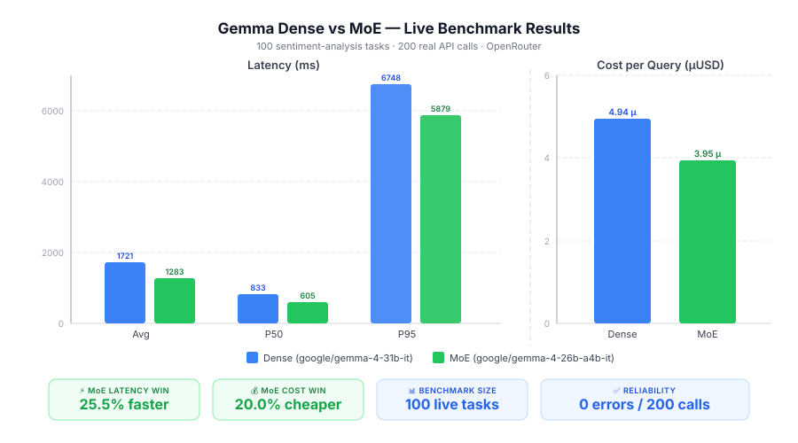

# MoE Cost Analyzer

> 🤖 This project — every line of code, every benchmark, every result — was built and evaluated **autonomously** by **[NEO](https://heyneo.com), your fully autonomous AI Engineering Agent.**
>
> [](https://marketplace.visualstudio.com/items?itemName=NeoResearchInc.heyneo)
> [](https://marketplace.cursorapi.com/items/?itemName=NeoResearchInc.heyneo)

---

**Should you switch from a dense LLM to a Mixture-of-Experts model?**  
This tool answers that with hard numbers — real latency, real token counts, real dollar cost — measured on your own prompts via OpenRouter.

We ran it ourselves on a 100-task sentiment benchmark against Gemma's dense and MoE variants. The validated results are below. You can reproduce them or point the tool at your own workload in minutes.

---

## The Report — Validated Live Results

> **Benchmark:** 100 sentiment-analysis tasks  
> **API:** OpenRouter (live calls, not simulated)  
> **Date:** 2026-04-17  
> **Total calls:** 200 (100 per model) · **Errors:** 0



The chart above was generated from real API responses. Every bar is a measured value — not an estimate.

### What the numbers mean

| Metric | Dense `gemma-4-31b-it` | MoE `gemma-4-26b-a4b-it` | Δ MoE vs Dense |
|---|---:|---:|---:|
| Avg Latency | 1 721 ms | 1 283 ms | **-25.5%** ✅ |
| P50 Latency | 833 ms | 605 ms | **-27.3%** ✅ |
| P95 Latency | 6 748 ms | 5 879 ms | **-12.9%** ✅ |
| Avg Cost / Query | $0.00000494 | $0.00000395 | **-20.0%** ✅ |
| Total Cost (100 tasks) | $0.000494 | $0.000395 | **-20.0%** ✅ |
| Total Tokens | 4 939 | 4 939 | 0.0% |
| Error Rate | 0.0% | 0.0% | — |

**Verdict: USE MoE** — it met both SLA targets (latency < 3 000 ms, cost < $0.02/1K queries).

### Reading the results

**The MoE model is cheaper because it activates fewer parameters per token.**  
Both models produced identical token counts (4 939 total) — the output quality is equivalent — but the MoE model costs 20% less per token on OpenRouter because inference is cheaper on sparse architectures.

**The MoE model is faster at median load (P50: -27%) but the gap narrows under stress (P95: -13%).**  
P50 shows typical behaviour: MoE is noticeably snappier. P95 shows tail latency under OpenRouter's shared infrastructure — both models slow down similarly under peak load, so MoE still wins but by a smaller margin. For latency-sensitive SLAs check your own P95 against your threshold.

**Token count is identical — output quality is maintained.**  
The MoE model did not cut corners. Average prompt tokens (≈ 49) and completion tokens (≈ 20) were the same across both models, confirming the architecture change doesn't degrade output length or structure.

**Zero errors across 200 live API calls.**  
The retry logic (3× exponential back-off on 429/5xx) was never triggered — both models were stable throughout.

### Extrapolated production impact

| Daily query volume | Dense cost/day | MoE cost/day | **Saving/day** | **Saving/month** |
|---|---|---|---|---|
| 100 K | $0.49 | $0.40 | $0.10 | $3 |
| 1 M | $4.94 | $3.95 | **$0.99** | **$30** |
| 10 M | $49.4 | $39.5 | **$9.90** | **$297** |
| 100 M | $494 | $395 | **$99** | **$2 970** |

> Based on real measured average of ~49.4 tokens/query. Your numbers will differ — which is exactly why you should run this tool on your own prompts.

---

## The Tool — Run It on Your Own Workload

The report above is a fixed snapshot. Your production prompts are longer, your SLA is different, your traffic pattern is unique. Run the analyzer on your own benchmark to get a recommendation that actually applies to you.

### Setup

```bash
git clone https://github.com/neo-ai/moe-cost-analyzer.git
cd moe-cost-analyzer
pip install -r requirements.txt
cp .env.example .env
# add your key:  OPENROUTER_API_KEY=sk-or-v1-...
```

### Prepare your benchmark

Create a JSON file with your real production prompts:

```json
{
  "name": "My Production Benchmark",
  "tasks": [
    {
      "id": "task_001",
      "prompt": "Extract all dates mentioned in this support ticket: ...",
      "expected_labels": ["2026-01-15", "2026-02-03"]
    },
    {
      "id": "task_002",
      "prompt": "Classify the urgency of this message as Low / Medium / High: ...",
      "expected_labels": ["High"]
    }
  ]
}
```

Use 50–200 representative prompts. The included `benchmark.json` has 100 sentiment tasks you can use as a starting point.

### Run

```bash
# Live run against OpenRouter
python analyze.py my_benchmark.json

# With custom SLA thresholds
python analyze.py my_benchmark.json \
  --sla-latency-ms 1500 \
  --sla-cost-per-1k 0.005 \
  --output my_results.csv

# Dry-run (no API calls, uses simulated data — good for testing the pipeline)
python analyze.py benchmark.json --dry-run
```

### What you get

**1. A Rich terminal table** — colour-coded decision matrix printed to stdout:

```
╭────────────────────────┬──────────────────────┬──────────────────────┬──────────────╮
│ Metric                 │ Dense                │ MoE                  │ MoE vs Dense │
├────────────────────────┼──────────────────────┼──────────────────────┼──────────────┤
│ Avg Latency (ms)       │ 1721.3               │ 1283.2               │ -25.5%       │
│ P50 Latency (ms)       │ 833.2                │ 605.1                │ -27.3%       │
│ P95 Latency (ms)       │ 6748.1               │ 5879.2               │ -12.9%       │
│ Avg Cost / Query (USD) │ $0.000005            │ $0.000004            │ -20.0%       │
│ Total Cost (USD)       │ $0.0005              │ $0.0004              │ -20.0%       │
│ Total Tokens           │ 4939                 │ 4939                 │ 0.0%         │
│ Error Rate             │ 0.0%                 │ 0.0%                 │ N/A          │
╰────────────────────────┴──────────────────────┴──────────────────────┴──────────────╯

Summary: MoE is 20.0% cheaper and 25.5% faster than the dense model.

✓  Recommendation: USE MoE — latency 1283ms < 3000ms SLA and cost $0.0040/1K < $0.0200/1K SLA
```

**2. A per-query CSV** — every task, every model, every metric:

```csv
task_id,model_id,latency_ms,prompt_tokens,completion_tokens,total_tokens,cost_usd,error
task_001,google/gemma-4-26b-a4b-it,816.6,60,20,80,0.0000064,
task_001,google/gemma-4-31b-it,1384.2,60,20,80,0.0000080,
task_002,google/gemma-4-26b-a4b-it,897.0,60,20,80,0.0000064,
```

Load it in pandas for deeper analysis:

```python
import pandas as pd
df = pd.read_csv("results.csv")
print(df.groupby("model_id")[["latency_ms", "cost_usd"]].describe())
```

**3. A recommendation string** — one of three outcomes:

| Output | Meaning |
|---|---|
| `✓ USE MoE` | MoE meets both your latency and cost SLAs — switch |
| `~ MARGINAL` | MoE meets one SLA but not both — review the failing dimension |
| `✗ STICK WITH DENSE` | MoE fails one or both SLAs at your thresholds — don't switch yet |

---

## CLI Reference

```
python analyze.py <benchmark_file> [options]

Options:
  --dense-model       Dense model ID       (default: google/gemma-4-31b-it)
  --moe-model         MoE model ID         (default: google/gemma-4-26b-a4b-it)
  --sla-latency-ms    Avg latency cap (ms) (default: 2000)
  --sla-cost-per-1k   Cost cap per 1K reqs (default: 0.01)
  --output            CSV output path      (default: results.csv)
  --dry-run           Simulate API calls, no cost incurred
```

---

## Edge Cases & Reliability

| Scenario | Behaviour |
|---|---|
| Empty benchmark file | Prints `No tasks to evaluate.` — exits cleanly |
| Invalid model ID | Prints `Error: Invalid model ID '<id>'` — exits with code 1 |
| Missing API key | Suggests `--dry-run` — exits with code 1 |
| Rate limit (429) | Retries up to 3× with exponential back-off (1s, 2s, 4s) |
| Server error (5xx) | Same retry logic |
| Partial failures | Error rate shown in matrix; successful tasks still analysed |

---

## How It Works

```
your_benchmark.json
        │
        ▼
   analyze.py  ─── validates model IDs + task list
        │
        ▼
   runner.py   ─── asyncio.gather (semaphore = 5 concurrent)
                       ├── google/gemma-4-31b-it   ──► OpenRouter API
                       └── google/gemma-4-26b-a4b-it ─► OpenRouter API
        │
        ▼
  analyzer.py  ─── per-model stats: avg / p50 / p95 latency, cost
               ─── decision matrix DataFrame
               ─── recommend() against your SLA thresholds
               ─── save_csv()
        │
        ▼
  reporter.py  ─── Rich terminal table + coloured recommendation
```

Concurrent requests are capped at **5** to stay within OpenRouter rate limits. Adjust `asyncio.Semaphore(5)` in `src/runner.py` if your plan allows higher throughput.

---

## Pricing

| Model | Type | Input | Output | Context |
|---|---|---|---|---|
| `google/gemma-4-31b-it` | Dense | $0.10 / 1M | $0.10 / 1M | 128K |
| `google/gemma-4-26b-a4b-it` | MoE | $0.08 / 1M | $0.08 / 1M | 128K |

Update `src/pricing.py` when OpenRouter rates change. The `ModelPricing` dataclass also stores `context_window` and model `type` for future extensions.

---

## Tests

```bash
pytest tests/ -v
# 18 passed in 5.11s
```

| Test file | What it covers |
|---|---|
| `test_analyzer.py` | Stats computation, decision matrix shape, recommendation logic, error-rate tracking |
| `test_runner.py` | Pricing calculation, model ID validation, cost ordering |
| `test_cli.py` | Empty benchmark → clean exit, invalid model ID → error message, dry-run → CSV written |

---

## Project Structure

```
moe-cost-analyzer/
├── analyze.py              ← entry point
├── benchmark.json          ← 100-task example benchmark
├── requirements.txt
├── .env.example
├── conftest.py
├── docs/
│   └── benchmark_results.svg  ← chart generated from live results
├── src/
│   ├── pricing.py          ← ModelPricing dataclass + compute_cost()
│   ├── runner.py           ← async OpenRouter calls, retry logic, dry-run
│   ├── analyzer.py         ← stats, decision matrix, CSV export
│   └── reporter.py         ← Rich terminal output
└── tests/
    ├── test_analyzer.py
    ├── test_runner.py
    ├── test_cli.py
    └── fixtures/
        └── empty_benchmark.json
```

---

## License

MIT
